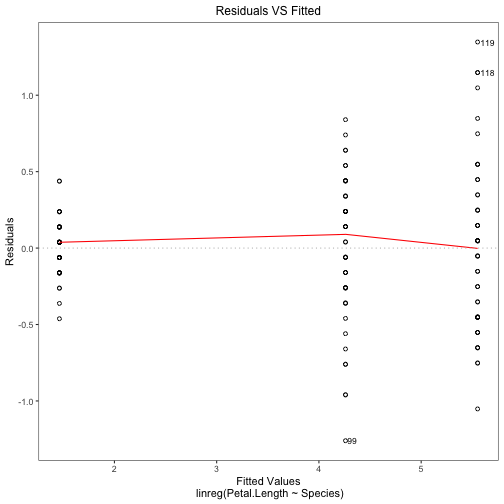
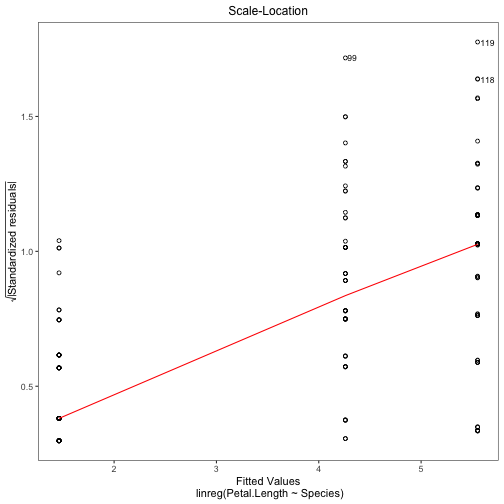

```r
devtools::install_github("AshenWELI/Assignment4")
#> Skipping install of 'assignment4' from a github remote, the SHA1 (6fa942ea) has not changed since last install.
#>   Use `force = TRUE` to force installation
library(assignment4)
```

### import sample dataset iris

```r
data(iris)
```

### create a linreg mode object using linreg@new function

```r
linreg_mod_object <- linreg$new(Petal.Length~Species, data = iris)
```

### print the coefficients and coefficient names according to multiple regression model

```r
linreg_mod_object$print()
#> call:
#> linreg(formula = Petal.Length ~ Species, data = iris)
#> 
#> Coefficients:
#>       (Intercept) Speciesversicolor  Speciesvirginica 
#>             1.462             2.798             4.090
```

### print two plots: Residuals vs Fitted and Scale−Location 

```r
linreg_mod_object$plot()
```



```
#> Hit <Return> to see the next plot...
```



```
#> Hit <Return> to see the next plot...
```

### print residuals e^ 

```r
linreg_mod_object$resid()
#>      1      2      3      4      5      6      7      8      9     10     11 
#> -0.062 -0.062 -0.162  0.038 -0.062  0.238 -0.062  0.038 -0.062  0.038  0.038 
#>     12     13     14     15     16     17     18     19     20     21     22 
#>  0.138 -0.062 -0.362 -0.262  0.038 -0.162 -0.062  0.238  0.038  0.238  0.038 
#>     23     24     25     26     27     28     29     30     31     32     33 
#> -0.462  0.238  0.438  0.138  0.138  0.038 -0.062  0.138  0.138  0.038  0.038 
#>     34     35     36     37     38     39     40     41     42     43     44 
#> -0.062  0.038 -0.262 -0.162 -0.062 -0.162  0.038 -0.162 -0.162 -0.162  0.138 
#>     45     46     47     48     49     50     51     52     53     54     55 
#>  0.438 -0.062  0.138 -0.062  0.038 -0.062  0.440  0.240  0.640 -0.260  0.340 
#>     56     57     58     59     60     61     62     63     64     65     66 
#>  0.240  0.440 -0.960  0.340 -0.360 -0.760 -0.060 -0.260  0.440 -0.660  0.140 
#>     67     68     69     70     71     72     73     74     75     76     77 
#>  0.240 -0.160  0.240 -0.360  0.540 -0.260  0.640  0.440  0.040  0.140  0.540 
#>     78     79     80     81     82     83     84     85     86     87     88 
#>  0.740  0.240 -0.760 -0.460 -0.560 -0.360  0.840  0.240  0.240  0.440  0.140 
#>     89     90     91     92     93     94     95     96     97     98     99 
#> -0.160 -0.260  0.140  0.340 -0.260 -0.960 -0.060 -0.060 -0.060  0.040 -1.260 
#>    100    101    102    103    104    105    106    107    108    109    110 
#> -0.160  0.448 -0.452  0.348  0.048  0.248  1.048 -1.052  0.748  0.248  0.548 
#>    111    112    113    114    115    116    117    118    119    120    121 
#> -0.452 -0.252 -0.052 -0.552 -0.452 -0.252 -0.052  1.148  1.348 -0.552  0.148 
#>    122    123    124    125    126    127    128    129    130    131    132 
#> -0.652  1.148 -0.652  0.148  0.448 -0.752 -0.652  0.048  0.248  0.548  0.848 
#>    133    134    135    136    137    138    139    140    141    142    143 
#>  0.048 -0.452  0.048  0.548  0.048 -0.052 -0.752 -0.152  0.048 -0.452 -0.452 
#>    144    145    146    147    148    149    150 
#>  0.348  0.148 -0.352 -0.552 -0.352 -0.152 -0.452
```

### print predicted values y^

```r
linreg_mod_object$pred()
#>     1     2     3     4     5     6     7     8     9    10    11    12    13 
#> 1.462 1.462 1.462 1.462 1.462 1.462 1.462 1.462 1.462 1.462 1.462 1.462 1.462 
#>    14    15    16    17    18    19    20    21    22    23    24    25    26 
#> 1.462 1.462 1.462 1.462 1.462 1.462 1.462 1.462 1.462 1.462 1.462 1.462 1.462 
#>    27    28    29    30    31    32    33    34    35    36    37    38    39 
#> 1.462 1.462 1.462 1.462 1.462 1.462 1.462 1.462 1.462 1.462 1.462 1.462 1.462 
#>    40    41    42    43    44    45    46    47    48    49    50    51    52 
#> 1.462 1.462 1.462 1.462 1.462 1.462 1.462 1.462 1.462 1.462 1.462 4.260 4.260 
#>    53    54    55    56    57    58    59    60    61    62    63    64    65 
#> 4.260 4.260 4.260 4.260 4.260 4.260 4.260 4.260 4.260 4.260 4.260 4.260 4.260 
#>    66    67    68    69    70    71    72    73    74    75    76    77    78 
#> 4.260 4.260 4.260 4.260 4.260 4.260 4.260 4.260 4.260 4.260 4.260 4.260 4.260 
#>    79    80    81    82    83    84    85    86    87    88    89    90    91 
#> 4.260 4.260 4.260 4.260 4.260 4.260 4.260 4.260 4.260 4.260 4.260 4.260 4.260 
#>    92    93    94    95    96    97    98    99   100   101   102   103   104 
#> 4.260 4.260 4.260 4.260 4.260 4.260 4.260 4.260 4.260 5.552 5.552 5.552 5.552 
#>   105   106   107   108   109   110   111   112   113   114   115   116   117 
#> 5.552 5.552 5.552 5.552 5.552 5.552 5.552 5.552 5.552 5.552 5.552 5.552 5.552 
#>   118   119   120   121   122   123   124   125   126   127   128   129   130 
#> 5.552 5.552 5.552 5.552 5.552 5.552 5.552 5.552 5.552 5.552 5.552 5.552 5.552 
#>   131   132   133   134   135   136   137   138   139   140   141   142   143 
#> 5.552 5.552 5.552 5.552 5.552 5.552 5.552 5.552 5.552 5.552 5.552 5.552 5.552 
#>   144   145   146   147   148   149   150 
#> 5.552 5.552 5.552 5.552 5.552 5.552 5.552
```

### print the coefficients

```r
linreg_mod_object$coef()
#>       (Intercept) Speciesversicolor  Speciesvirginica 
#>             1.462             2.798             4.090
```

### print summary statistics
including the coefficients with their standard error, t-value and p-value as well as the estimate of ^ σ and the degrees of freedom in the model

```r
linreg_mod_object$summary()
#> call:
#> linreg(formula = Petal.Length ~ Species, data = iris)
#> 
#> Residuals:
#>        Min     1Q Median   3Q   Max
#> [1,] -1.26 -0.258  0.038 0.24 1.348
#> 
#> Coefficients:
#>                   Estimate Std. Error  t value     Pr(>|t|)    
#> (Intercept)          1.462 0.06085848 24.02294 1.780926e-05 ***
#> Speciesversicolor    2.798 0.08606689 32.50960 5.337899e-06 ***
#> Speciesvirginica     4.090 0.08606689 47.52118 1.173064e-06 ***
#> 
#> Residual standard error: 0.430334468875131 on 147 degrees of freedom
```
